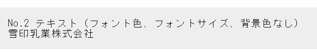

# BaseText

## サンプル

## 処理概要

文字を表示する部品。

## ソースファイル

`./src/components/atoms/BaseText.vue`

## プロパティ

### 共通

[ComponentCommonProperty](../types/component-common-property.md)

### 個別

| 物理名          | 型                                         | 説明         |
| --------------- | ------------------------------------------ | ------------ |
| label           | string                                     | 表示文字     |
| labelBackground | string                                     | 文字背景色   |
| labelAlign      | [CSS.TextAlign](../types/CSS.md#textalign) | 文字水平位置 |

## イベント

無し

## メソッド

無し

## スロット

無し
