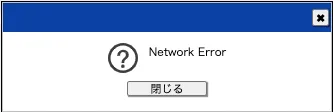
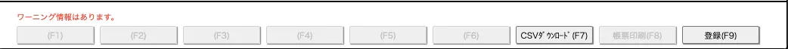

# メッセージ

## メッセージディレクトリ構成

```shell
src
├── molecules
│   └─ ConfirmationDialog.vue # Dialog部品
│
├── enums # Enums
│   ├─ msg-positations.ts # メッセージ位置
│   └─ msg-types.ts # メッセージタイプ
│
├── layouts #  レイアウト
│   └─ DefaultLayouts.vue # デフォルトレイアウト
│
├── services # サービス
│   └─ axios
│     └─ index.ts # 共通請求
│
├── stores # ストア
│   └─ dialog.ts # ダイアローグ
│
├── utils #　ユーティリティ
│   └─ message.ts # メッセージ
│   ...
```

## 画面イメージ

- ポップアップ
  

- フッター
  

## 共通メッセージ使用方法

共通メソッド「handlerMessage」にパラメータを渡し、自動的に、エラーメッセージを表示できるの共通部品です。

| No. | 名称               | 型                  | 説明                                          | 必須 |
| --- | ------------------ | ------------------- | --------------------------------------------- | ---- |
| 1   | メッセージ表示箇所 | MSGPositions        | メッセージ表示箇所<br>(ポップアップ/フッター) | ○    |
| 2   | メッセージタイプ   | MSGTypes            | メッセージタイプ<br>(ワーニング、エラーなど)  | ○    |
| 3   | メッセージ         | String              | メッセージ内容                                | ○    |
| 4   | ポップアップボタン | 配列(Button.Config) | ポップアップ画面で、表示したいボタン情報      | ×    |

##

```typescript
import { MSGPositions, MSGTypes } from '@/enums'
import type { Button } from '@/types/components/button'
import { handlerMessage } from '@/utils/message'
import { useDialog } from '@/stores/dialog'
// ポップアップ
handlerMessage(MSGPositions.POPUP, MSGTypes.ERROR, msg, buttonConfigs)
// フッター
handlerMessage(MSGPositions.FOOTER, MSGTypes.ERROR, msg)
```

### 使用例

```typescript
// 必要の部品をインポートする
import { MSGPositions, MSGTypes } from '@/enums'
import type { Button } from '@/types/components/button'
import { handlerMessage } from '@/utils/message'
import { useDialog } from '@/stores/dialog'

const { setShowDialog } = useDialog()
// メッセージはポップアップで表示する場合、ダイアローグのボタンを設定可能
const buttonConfigs: Button.Config[] = [
  {
    title: 'はい',
    disabled: false,
    width: '80',
    height: '15',
    onClick: () => {
      // TODO
      // はいを押下のロジック
    },
  },
  {
    title: 'いいえ',
    disabled: false,
    width: '80',
    height: '15',
    onClick: () => {
      // TODO
      // いいえを押下のロジック
      setShowDialog(false) // ダイアローグ非表示
    },
  },
]
handlerMessage(MSGPositions.POPUP, MSGTypes.ERROR, msg, buttonConfigs)
```
